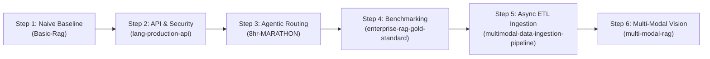

Listed directory someone-rag
Listed directory 8hr-MARATHON
Listed directory Basic-Rag
Listed directory enterprise-rag-gold-standard
Listed directory lang-production-api
Listed directory multi-modal-rag
Listed directory multimodal-data-ingestion-pipeline
Viewed README.md:1-171
Viewed README.md:1-76
Viewed README.md:1-395
Viewed README.md
Viewed Production-test-commands.sh:1-514
Viewed README.md:1-732
Viewed README.md:1-620

You have an **exceptional and comprehensive suite of 6 RAG projects** in your workspace ([d:/Workshop/someone-rag](file:///d:/Workshop/someone-rag)). Together, these repositories cover virtually every dimension of modern, production-grade Retrieval-Augmented Generation: from basic single-tool retrieval to agentic routing, security guardrails, production API middleware, industrial-scale async ingestion, evaluation benchmarks, and multi-modal layout intelligence.

Here is a comprehensive breakdown of your 6 projects, followed by a **6-Step Learning Roadmap** designed to help you systematically master Production RAG using this repository collection.

---

## 📂 Project Overview & Capabilities Analysis

```
                                    ┌────────────────────────────────────────────────────────┐
                                    │                   PRODUCTION RAG                       │
                                    └───────────────────────────┬────────────────────────────┘
                                                                │
         ┌───────────────────────┬──────────────────────────────┼──────────────────────────────┬─────────────────────────┐
         │                       │                              │                              │                         │
  1. FOUNDATION            2. SECURITY & API          3. AGENTIC & GATEWAYS          4. DATA INGESTION          5. MULTI-MODAL          6. BENCHMARK & EVALS
[Basic-Rag]            [lang-production-api]        [8hr-MARATHON]              [multimodal-data-           [multi-modal-rag]       [enterprise-rag-
                                                                                     ingestion-pipeline]                                  gold-standard]
• LangChain baseline   • Input Sanitization         • LangGraph State Graph     • Prefect 3.0 Orchestration • PP-DocLayout-V3       • Synthetic Enterprise Corpus
• Naive vector store   • PII Masking (4 regex/spaCy)• Portkey Fallback Gateway  • Docling OCR & Tables      • GLM-OCR / Ollama      • 23 Golden Q&A Triplets
• Groq + Qdrant Cloud  • Response Caching (TTL)     • NeMo Guardrails           • GLiNER2 Metadata & PII    • 4 Re-ranker Backends  • Context Precision & Faithfulness
• Basic guardrails     • Rate Limiting (slowapi)    • FlashRank Re-ranker       • SPLADE v3 Sparse + Dense  • Hybrid Qdrant Search  • Negative Constraint Rubric
```

---

### 1. [Basic-Rag](file:///d:/Workshop/someone-rag/Basic-Rag/README.md) — *The Foundation (Naive RAG Baseline)*
* **Focus**: Fundamentals of chunking, embedding, vector storage, and simple tool calling.
* **Key Architecture**:
  * Document ingestion from plain text (`hr_policy.txt`) using basic text splitters.
  * Vector storage using Qdrant Cloud and Jina embeddings (`jina-embeddings-v2-base-en`).
  * Basic tool wrapper for LangChain agents and prompt guardrails (`gpt-oss-safeguard-20b`).
* **Why it matters**: Serves as your benchmark for "Naive RAG." It helps you understand what simple chunking and similarity search can do—and where it fails (e.g., table loss, lack of multi-hop reasoning, no reranking).

---

### 2. [lang-production-api](file:///d:/Workshop/someone-rag/lang-production-api/Production-test-commands.sh) — *Production API & Security Layer*
* **Focus**: Hardening RAG endpoints for enterprise deployment, low latency, and abuse prevention.
* **Key Architecture**:
  * **FastAPI Middleware**: Pydantic input validation, structured JSON logging, request metrics.
  * **Security Pipeline**: Multi-layer input sanitizer (detecting prompt injections, DAN jailbreaks), PII detection & masking (email, phone, SSN, credit cards), and output validation.
  * **Performance & Protection**: Response cache with TTL & hit/miss tracking, token bucket rate-limiting (`slowapi`).
  * **Testing**: Comprehensive Pytest suite covering security, caching, and API endpoints.
* **Why it matters**: Real production RAG isn't just about LLM responses—it must be protected against prompt injection attacks, compliance/PII leaks, high latency, and rate abuse.

---

### 3. [8hr-MARATHON](file:///d:/Workshop/someone-rag/8hr-MARATHON/README.md) — *Enterprise Agentic RAG & Fallback Gateways*
* **Focus**: Graph-based agent orchestration, multi-provider LLM gateways, and local re-ranking.
* **Key Architecture**:
  * **LangGraph Agent**: Cyclic state graph with dedicated `Planner`, `Retriever`, and `Responder` nodes.
  * **NeMo Guardrails**: Pre-retrieval safety gating.
  * **Portkey LLM Gateway**: Automatic fallback routing between primary and backup Groq API keys.
  * **FlashRank Reranker**: Zero-latency local semantic re-ranking to filter vector retrieval noise.
  * **Observability & Evals**: Tracing with Pydantic Logfire & LangSmith + RAGAS evaluation suite.
* **Why it matters**: Demonstrates how to move beyond static top-k vector retrieval to **Agentic RAG**, where the agent dynamically plans, decides whether retrieval is required, reranks documents locally, and handles upstream LLM API outages gracefully.

---

### 4. [enterprise-rag-gold-standard](file:///d:/Workshop/someone-rag/enterprise-rag-gold-standard/README.md) — *Evaluation & Ground-Truth Benchmark*
* **Focus**: Quantitative evaluation of RAG retrieval accuracy, multi-hop reasoning, and handling document contradictions.
* **Key Architecture**:
  * **AeroVelo Logistics Global Corpus**: Realistic corporate documents (SOPs, regional governance matrices, finance frameworks, HR policies, visual PDF traps).
  * **Golden Triplets**: 23 validated eval entries across 3 complexity tiers (Level 1: Direct lookup, Level 2: Multi-hop reasoning across documents, Level 3: Policy contradiction & synthesis).
  * **Metrics Suite**: Context Precision, Faithfulness (via LLM Judge or local heuristic), Answer Relevance, and Keyword Match with negative constraint penalties.
* **Why it matters**: "If you cannot measure it, you cannot improve it." This repository provides the scientific foundation to test whether any prompt, chunking strategy, or vector database change improves or degrades overall system accuracy.

---

### 5. [multimodal-data-ingestion-pipeline](file:///d:/Workshop/someone-rag/multimodal-data-ingestion-pipeline/README.md) — *Async Data ETL & Metadata Ingestion*
* **Focus**: Industrial-scale document processing, multi-modal extraction, and dual vector indexing.
* **Key Architecture**:
  * **Orchestration**: Prefect 3.0 async flows with controlled concurrency (`asyncio.gather` + `Semaphore`).
  * **Parsing & Extraction**: Docling conversion (retaining table markdown, LaTeX formulas, base64 images), arXiv paper API auto-downloader, AWS S3 async streaming (`aioboto3`).
  * **Enrichment & Safety**: GLiNER2 3-level metadata extraction + 42-type PII redaction across 7 languages.
  * **Vector & Relational Storage**: Dense embeddings (`jina-omni-nano` 768d) + Sparse embeddings (`SPLADE v3` 30522d), Qdrant RRF hybrid search, and NeonDB PostgreSQL dual-table registry (`documents` + `chunks`).
* **Why it matters**: Teaches you how to build production ETL data pipelines that parse hundreds of complex PDFs asynchronously without hitting memory limits or missing document metadata.

---

### 6. [multi-modal-rag](file:///d:/Workshop/someone-rag/multi-modal-rag/README.md) — *Advanced Vision & Multi-Backend Reranking*
* **Focus**: Deep document vision, OCR visual inspection, hybrid search, and pluggable re-rankers.
* **Key Architecture**:
  * **Layout & OCR**: PP-DocLayout-V3 (23 element categories) + GLM-OCR 0.9B (cloud Z.AI or 100% local Ollama).
  * **Multimodal Ingestion**: GPT-4o figure captioning + structure-aware chunking (preserving atomic formulas/tables).
  * **Pluggable Rerankers**: Choice of 4 backends: OpenAI `GPT-4o-mini`, Jina `M0`, local BAAI `BGE`, or local multimodal `Qwen VL`.
  * **Visual Inspector**: Streamlit UI with polygon overlays and color-coded bounding boxes.
* **Why it matters**: Real enterprise documents (financial reports, engineering diagrams, research papers) are inherently multi-modal. This repository gives you state-of-the-art tools to handle images, charts, and complex page layouts.

---

## 🗺️ Master Learning Roadmap (6-Step Path)

To master production RAG efficiently, follow this progressive learning roadmap:



### Phase 1: Foundations & API Resilience
1. **Master Basic RAG**: Run `Basic-Rag` to establish your baseline understanding of chunking, vector indexing, and simple query tool calls.
2. **Productionize the API**: Study `lang-production-api`. Understand how to protect your RAG API with PII masking, prompt injection filters, rate limiting, and response caching.

### Phase 2: Agentic Intelligence & Evaluation
3. **Build Agentic RAG**: Explore `8hr-MARATHON`. Learn how LangGraph splits logic into stateful nodes (Planner, Retriever, Responder), how FlashRank reranks retrieved chunks, and how Portkey handles LLM failover.
4. **Establish Benchmark Evals**: Run `enterprise-rag-gold-standard`. Execute evaluation runs across Level 1, 2, and 3 test cases. Observe how naive retrieval breaks on multi-hop questions and document conflicts.

### Phase 3: Enterprise Data Pipeline & Vision
5. **Scale Up Ingestion**: Work through `multimodal-data-ingestion-pipeline`. Learn how Prefect orchestrates batch PDF parsing, how Docling extracts tables, how GLiNER2 extracts structured metadata, and how SPLADE v3 + Dense embeddings power Qdrant hybrid search.
6. **Master Multi-Modal RAG**: Complete your journey with `multi-modal-rag`. Experiment with layout detection, visual bounding box inspection, local Ollama OCR, and multi-modal reranking using Qwen VL and BGE.

---

## 📊 Capability Coverage Matrix

| Feature / Technique | Basic-Rag | lang-production-api | 8hr-MARATHON | enterprise-rag-gold-standard | multimodal-data-ingestion-pipeline | multi-modal-rag |
| :--- | :---: | :---: | :---: | :---: | :---: | :---: |
| **Vector DB (Qdrant)** | ✅ | — | ✅ | ✅ | ✅ (Hybrid Dense+Sparse) | ✅ (Hybrid Dense+BM25) |
| **Relational Metadata Registry** | — | — | — | — | ✅ (NeonDB Postgres) | — |
| **Prompt Injection Protection** | Basic | ✅ (Sanitizer) | ✅ (NeMo) | — | — | — |
| **PII Detection & Redaction** | — | ✅ (Regex/Masking) | — | — | ✅ (GLiNER2 42 types) | — |
| **LLM Gateway / Failover** | — | — | ✅ (Portkey) | — | — | — |
| **Reranking** | — | — | ✅ (FlashRank) | — | — | ✅ (OpenAI/Jina/BGE/Qwen) |
| **Orchestration Framework** | LangChain | FastAPI | LangGraph | CLI/Custom | Prefect 3.0 | FastAPI / Scripts |
| **Multi-Modal / Vision / OCR** | — | — | — | PDF Tables | Docling (Tables/Formulas) | ✅ (PP-DocLayout-V3, GLM-OCR) |
| **Eval Framework & Evals** | — | — | ✅ (RAGAS) | ✅ (Golden 23 Bench) | — | — |

---

## 💡 Next Steps & Recommendation

You have a complete toolkit to master every aspect of production RAG. 

Would you like to start by:
1. **Running & testing one of the specific projects** (e.g. setting up environment variables or launching a local test)?
2. **Deep-diving into a specific sub-topic** (e.g. Agentic RAG routing, hybrid dense/sparse search, or RAG evaluation metrics)?
3. **Designing a unified architecture** that combines the best features of all 6 projects into one ultimate RAG stack?